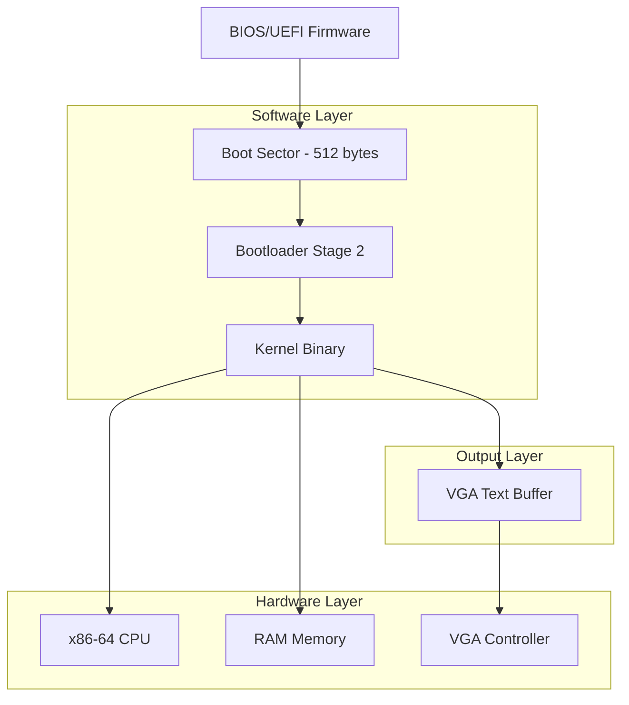
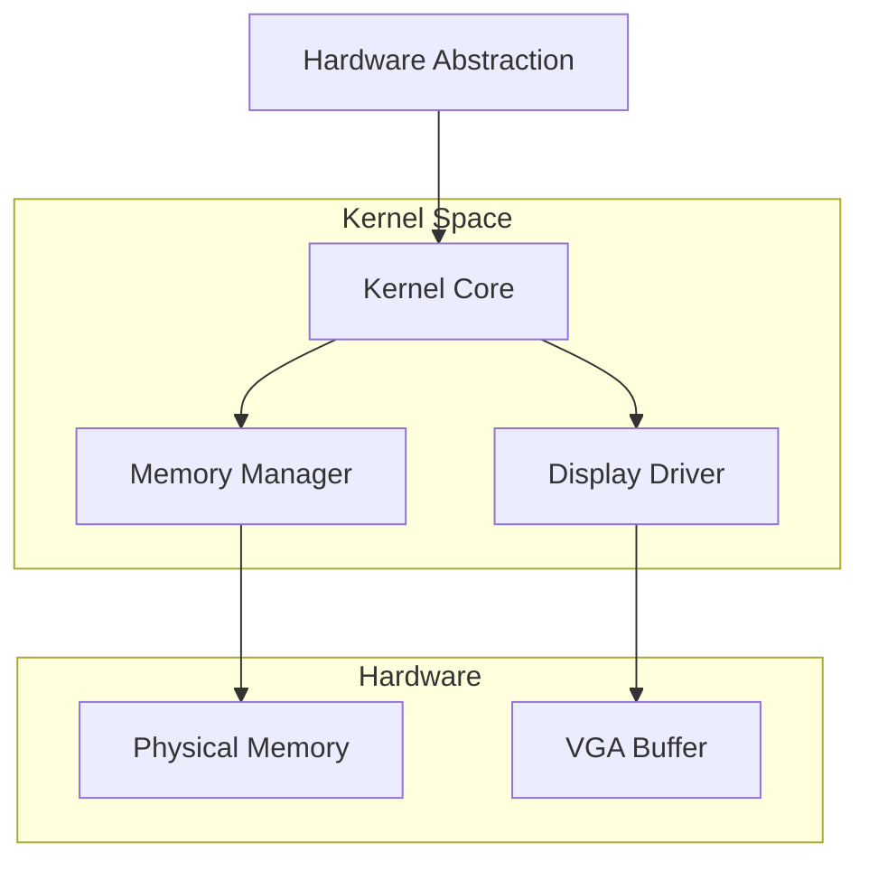
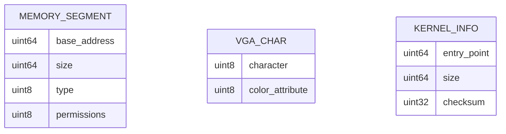

# الهيكل التقني لنظام التشغيل البسيط

## 1. تصميم المعمارية



## 2. وصف التقنيات

* Frontend: لا يوجد (نظام تشغيل منخفض المستوى)

* Backend: Assembly x86-64 + C

* Build System: GNU Make + GCC + NASM

* Testing: QEMU Emulator

## 3. تعريفات المسارات

| المسار  | الغرض                  |
| ------- | ---------------------- |
| /boot   | ملفات الإقلاع والتحميل |
| /kernel | ملفات النواة الأساسية  |
| /build  | ملفات البناء والتجميع  |

## 4. تعريفات واجهة البرمجة

### 4.1 واجهات النواة الأساسية

إخراج النص

```
void print_string(const char* str)
```

المعاملات:

| اسم المعامل | نوع المعامل  | مطلوب | الوصف              |
| ----------- | ------------ | ----- | ------------------ |
| str         | const char\* | true  | النص المراد طباعته |

الاستجابة:

| اسم المعامل | نوع المعامل | الوصف              |
| ----------- | ----------- | ------------------ |
| void        | void        | لا توجد قيمة إرجاع |

مثال:

```c
print_string("hi");
```

## 5. مخطط معمارية الخادم



## 6. نموذج البيانات

### 6.1 تعريف نموذج البيانات



### 6.2 لغة تعريف البيانات

جدول خريطة الذاكرة (memory\_map)

```c
// هيكل خريطة الذاكرة
struct memory_segment {
    uint64_t base_address;     // العنوان الأساسي
    uint64_t size;             // حجم القطعة
    uint8_t type;              // نوع الذاكرة (متاحة/محجوزة)
    uint8_t permissions;       // صلاحيات الوصول
};

// مصفوفة VGA للنص
struct vga_char {
    uint8_t character;         // رمز الحرف
    uint8_t color_attribute;   // لون الحرف والخلفية
};

// معلومات النواة
struct kernel_info {
    uint64_t entry_point;      // نقطة دخول النواة
    uint64_t size;             // حجم النواة
    uint32_t checksum;         // مجموع التحقق
};

// ثوابت النظام
#define VGA_TEXT_BUFFER 0xB8000
#define KERNEL_LOAD_ADDRESS 0x100000
#define BOOTLOADER_ADDRESS 0x7C00
```

